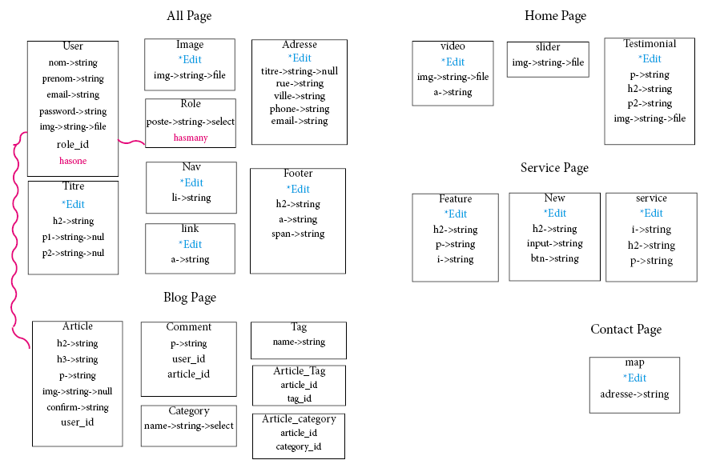

## Projet Labs

Dans ce projet je dois créer une base de donnée complete pour un template fourni d'une home, d'une section service, blog et contact. 
Ci-dessous sont noter mes étapes de création, ainsi que le design de ma structure back-end:

- Création de la table.
- Création du seeder.
- Création du model.
- Création du controller.
- Ajouter le Auth.
- Ajouter la route.
- Ajouter le gate.
- Création du Policy.
- Création du back-office.
- Ajouter les @can.
- intégrer les btn dans le front.
- Lier les données de crud avec le front.
- Tester l'affichage final et les fonctionnalités.

Par défaut les noms dans la database correspond aux balises de leurs section, sauf si cette dernière possède un nom dans sa classe.

## Cahier des charges

Info client: -Nom: Elias -Entreprise: Molengeek

Contenu du site: Front fourni par l'employeur 
- Section home.
- Section service.
- Section blog.
- Section Contact.

Contenu du site: Back créer par moi-même 
- dashboard, contenu de chaque partie customisable.
- Chaque section possède un edit et/ou un create et un delete.

Valeur du site: 3000€ 
Prix pour 10 jours de travail: 1100€

## Langage et librairie utiliser

- Html.
- Css.
- JavaScript.
- Laravel.
- Php.
- Bootstrap.
- Tailwind.

## User DataBase

- Email: walter@mail.com , Mdp: aaaaaaaa
- Email:sarah@mail.com , Mdp: aaaaaaaa

## Structure de ma base de donnée

